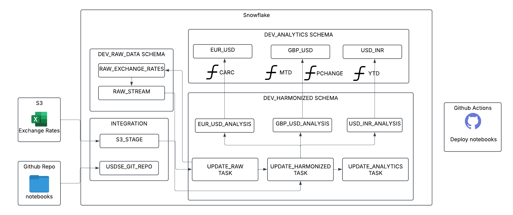

# SNOWFLAKE_DEXUS_QUICKSTART

This repository contains the code for the _Data Engineering with Notebooks_ on USD Spot Exchange dataset.

## Project Overview

This project implements an end-to-end data engineering pipeline using Snowflake for processing and analyzing USD Spot Exchange data. The solution leverages Snowflake's native features including Snowpark, tasks, and stored procedures to create an automated data processing workflow.

### Tech Stack

- **Snowflake**: Primary data warehouse and processing platform
- **Snowpark**: For Python-based data transformations
- **Snowflake Notebooks**: For interactive development and documentation

### ➡️ For overview, prerequisites, and to learn more, complete this end-to-end tutorial created by us [DEXUS_QUICKSTART](https://codelabs-preview.appspot.com/?file_id=14kBgl0rY1y6dWH-sqAnVcINs56WvqHWE-31ezdLy92U#0) on codelabs.

## Project Architecture

Here is an overview of what we'll build in this tutorial:



### Project Links

- Video Walkthrough: [https://youtu.be/nrw8KiRCwU4](https://youtu.be/nrw8KiRCwU4)
- GitHub Projects: [https://github.com/users/AshishNevan/projects/2](https://github.com/users/AshishNevan/projects/2)

## Directory Structure

```
SNOWFLAKE_DEXUS_QUICKSTART/
├── 00_usdse_start_here.ipynb    # Entry point notebook
├── notebooks/                    # Main notebooks directory
│   └── SETUP_PIPELINE/          # Pipeline setup notebooks
├── scripts/                      # SQL and utility scripts
│   └── deploy_notebooks.sql     # Deployment scripts
├── images/                      # Project documentation images
└── requirements.txt             # Python dependencies
```

## Getting Started

### Prerequisites

1. Snowflake Account with ACCOUNTADMIN role
2. Python 3.8 or higher
3. Git for version control

### Setup Instructions

1. Fork the repository

2. Create `dev` branch

3. Download `00_usdse_start_here.ipynb`

4. Import the downloaded notebook in snowflake notebooks

5. Add Github connection variables (Personal Access Token)

6. Run all cells, new `SETUP_PIPELINE.ipynb` notebook will be deployed
   `
7. Run `DEV_SETUP_PIPELINE.ipynb` and tasks will be created in `DEV` environment, edit as needed

8. Once dev is ready to be deployed, create a PR onto main branch

9. `PROD` environment will be automatically created and tasks will be launched via Github Actions

## Team Member Contributions

### Team Members

- Adwaith Korapati - 33%
- Ashish Nevan Gade - 33%
- Neha Devarpalli - 33%

### AI Tools Usage

This project utilized the following AI tools to enhance development:

- GitHub Copilot: For code suggestions and documentation
- Claude AI: For README documentation and code review

## Development Process

### Prototyping

The initial prototyping work for this project is maintained in a separate folder called `prototyping`. This includes:

- Initial data exploration scripts
- Tool evaluation notebooks
- Proof of concept implementations
- Performance testing results
